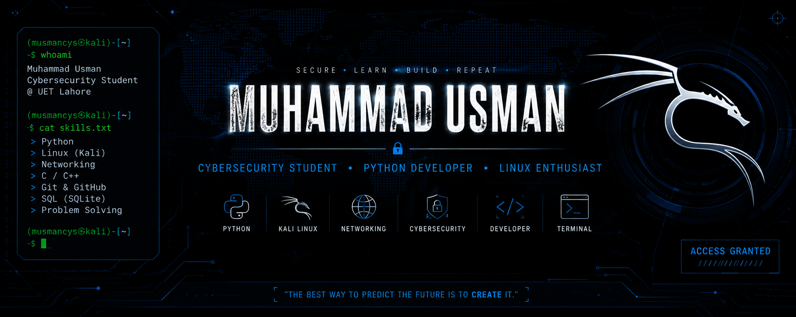

## Profile Views

<p align="left">


</p>


---
<div align="center">



</div>

```bash
┌──(musmancys㉿kali)-[~]
└─$ whoami

Muhammad Usman
Cybersecurity Student @ UET Lahore

┌──(musmancys㉿kali)-[~]
└─$ cat interests.txt

Cybersecurity
Python Development
Linux (Kali)
Networking
C++
Git & GitHub

┌──(musmancys㉿kali)-[~]
└─$ echo "Currently Learning"

Ethical Hacking
Python Automation
Linux Administration
Networking Fundamentals
```

---

# About Me

I'm a **Cybersecurity student at UET Lahore** passionate about learning how systems work, writing clean code, and building practical security-related projects.

I enjoy:

- Building Python applications
- Working with Linux
- Learning networking concepts
- Exploring cybersecurity tools
- Creating projects that solve real problems

---

# Tech Stack

### Languages


### Operating Systems


### Tools


---

# Currently Learning

- Python
- Linux
- Bash Scripting
- Networking
- Cybersecurity Fundamentals
- Git & GitHub

---

# Featured Projects

| Project | Description |
|---------|-------------|
| ECAT Dual Portal | Python CLI examination system |
| Python Projects | Collection of Python practice projects |
| Linux Scripts | Useful Linux automation scripts |
| Cybersecurity Labs | Notes and practice labs |
| Password Manager | Secure password manager |
| Packet Sniffer | Networking project |

---

## 📊 GitHub Statistics

<p align="center">
  
  
</p>

---

# GitHub Streak

<div align="center">


</div>

---

# Contribution Graph

<div align="center">


</div>

---
## 💻 Live Terminal

```bash
┌──(musmancys㉿kali)-[~]
└─$ watch -n 1 github contributions

Initializing...

████████████████████████████

Loading contribution map...

✓ Snake initialized.

```
## 🐍 Contribution Snake

<p align="center">
  
</p>
```
# Goals for 2026

- Build 20+ Python projects
- Learn Advanced Linux
- Master Networking Fundamentals
- Complete Cybersecurity Labs
- Contribute to Open Source
- Build Security Tools

---
### Thanks for visiting!

*"Stay curious. Keep learning. Build something meaningful."*

</div>
